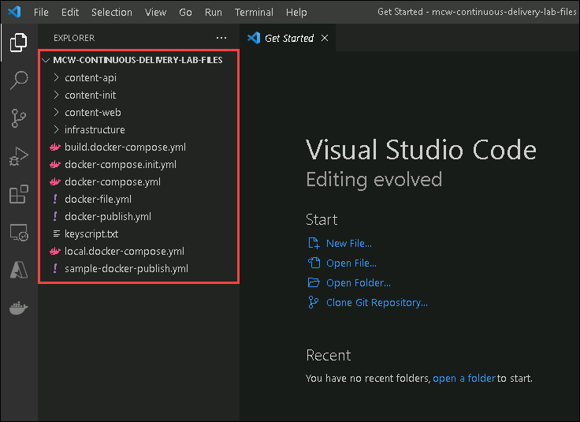
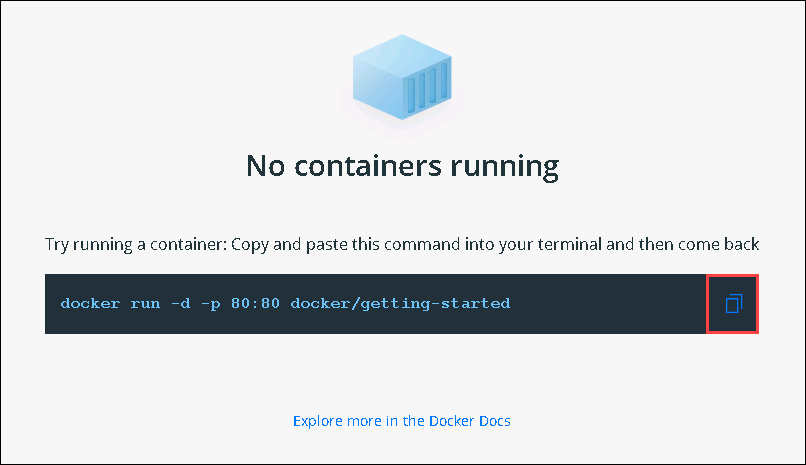
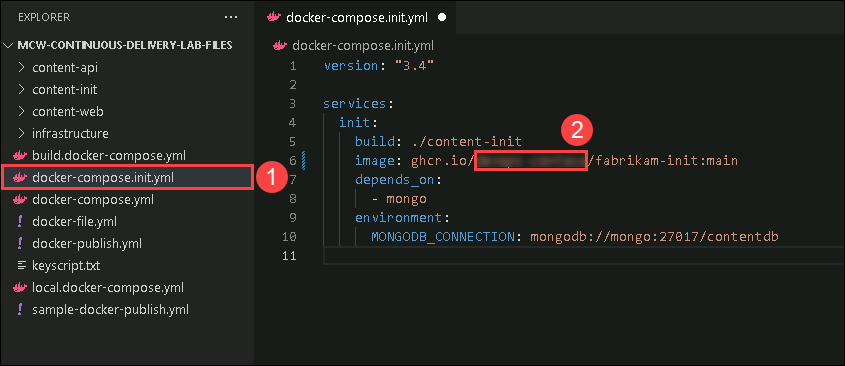
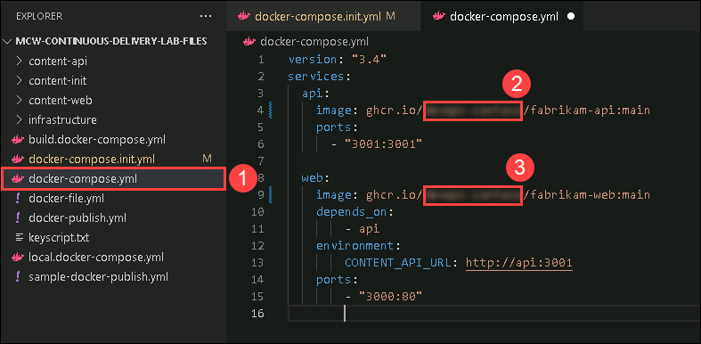
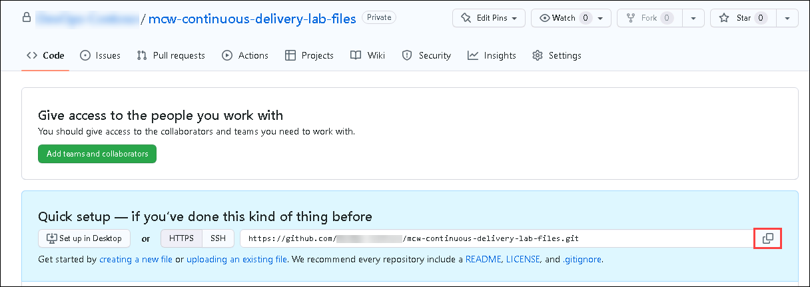
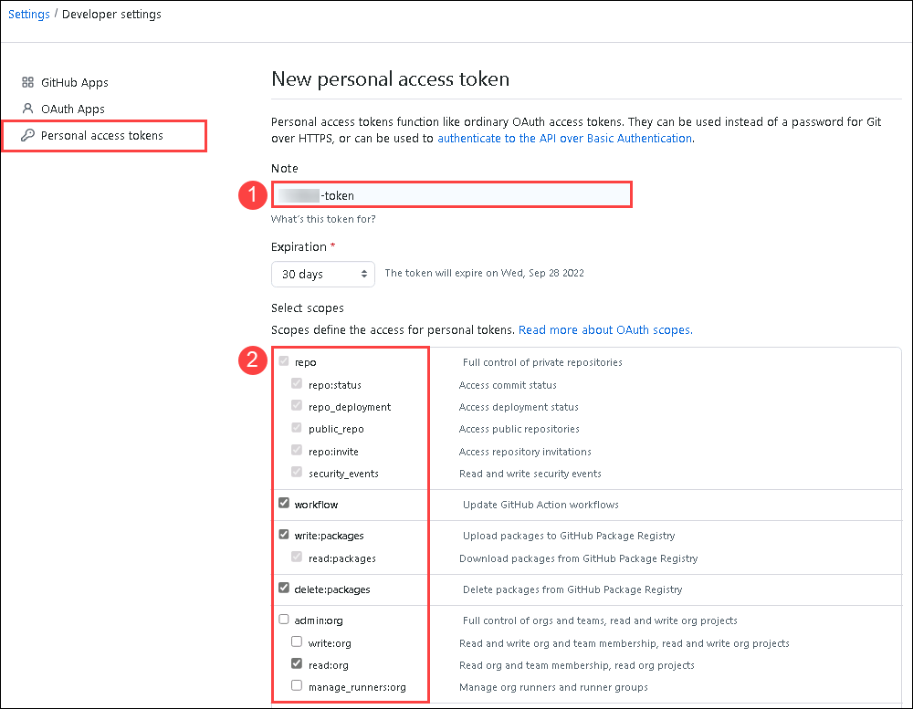

# Exercise 1: Continuous Integration

Duration: 90 minutes

### Task 1: Access the lab files.

1. From the VM desktop, double click on the **Visual Studio Code** desktop icon to open the application.

   
   
1. In **Visual Studio Code**, click on **File** **(1)** at the left top and select **Open Folder** **(2)**.

   

1. In the **Open Folder** tab, navigate to the following path `C:\Workspaces\lab\mcw-continuous-delivery-lab-files` to open your local GitHub repository and click on **Select Folder**.

   
    
1. You may receive a prompt that: Do you trust the authors of the files in this folder? select the **checkbox** **(1)** the box and click on **Yes, I trust the authors** **(2)**.

   
   
1. You'll be to see the lab files in Visual Studio code, explore the code files.

   

### Task 2: Start the Docker application.

1. Minimize the browser and open the **Docker application** from the LabVM desktop. You may find that docker is stopping abruptly, try starting it multiple times to fix it.

   
  
   >**Note**: If you get a warning pop up saying **Windows 17762 deprecated**. Please click on **OK**. Docker application might take a few seconds to open, please wait till the application opens.
   
1. Click on **Start**.

   

1. Skip the tutorial pop up by clicking on **Skip tutorial** situated in the bottom-left corner of the application.

   
   
1. **Copy** the command from the docker application page and **save it** in a notepad for future use.

   
   
   >**Note**: If the Docker application is taking more than 10 mins to start. Please follow the steps from the `https://github.com/CloudLabs-MCW/MCW-Continuous-delivery-in-Azure-DevOps/blob/microsoft-devops-with-github-v2/Hands-on%20lab/docker-install.md` link and start the Docker again.
   
1. Open Visual Studio Code application which was accessed in previous task. Select **Terminal** ***(1)*** and click on **New Terminal** ***(2)*** to open the terminal. It will open a new PowerShell session which you'll be using throughout the lab.

   
   
1. Paste the **docker run** command which you had copied earlier and wait till the execution completes.

   
   
1. After the execution completes, open the **Docker application**. You should be able to see a container in a running state. This confirms the running of the Docker application.

   

### Task 3: Set up Local Infrastructure

11. Now you are going to set up the local infrastructure using Docker containers. There are three images you will be working with:

  - `fabrikam-init`
  - `fabrikam-api`
  - `fabrikam-web`

  You will need to make some edits to files before running these locally. In this task, you will confirm that the Docker infrastructure works locally.
  
  >**Note**: You should replace three instances of `<yourgithubaccount>` - one instance in `docker-compose.init.yml` and two instances in `docker-compose.yml`.

1. From the **Visual Studio Code**, click on **File** **(1)** at the left top and select **Open Folder** **(2)**.

   

1. In the **Open Folder** tab, navigate to the following path `C:\Workspaces\lab\mcw-continuous-delivery-lab-files` to open your local GitHub repository and click on **Select Folder**.

   
    
1. You may receive a prompt that: Do you trust the authors of the files in this folder? select the **checkbox** **(1)** the box and click on **Yes, I trust the authors** **(2)**.

   
   
1. From the Explorer, open the `docker-compose-init.yml` ***(1)***  and replace `<yourgithubaccount>` ***(2)*** value in line no. 6 with your GitHub username. After updating save the file using CTRL+S.
   
   
   
   >**Note**: The `<yourgithubaccount>` value must be in **lowercase**, if your GitHub account user name is in uppercase letters please change it to lowercase in Github. [Github Username Change](https://docs.github.com/en/account-and-profile/setting-up-and-managing-your-github-user-account/managing-user-account-settings/changing-your-github-username)
    
1. From the Explorer, open the `docker-compose.yml`(1) and replace `<yourgithubaccount>` value in line no. 4 and 9 with your GitHub account name. After updating save the file using CTRL+S.    

   
   
1. Open a **New Terminal** in the Visual Studio Code by selecting **Terminal (1)** then on **New Terminal (2)**.

   
    
   >**Note**: These commands execution may take around 10-15 minutes to complete.

   Run the following commands in the terminal to build and run the docker-compose YAML files edited in the previous steps.
    
   ```pwsh
   cd C:\Workspaces\lab\mcw-continuous-delivery-lab-files
   docker-compose -f .\docker-compose.yml -f .\local.docker-compose.yml -f .\docker-compose.init.yml build
   docker-compose -f .\docker-compose.yml -f .\local.docker-compose.yml -f .\docker-compose.init.yml up
   ```
    
   
   
1. Verify that you can browse to `http://localhost:3000` in a browser and arrive at the Fabrikam conference website.

   
    
1. Leave this terminal in running and open a new terminal. Paste the following command and hit `<ENTER>`.

   ```pwsh
   cd C:\Workspaces\lab\mcw-continuous-delivery-lab-files
   ```
1. Commit and push your changes to your GitHub repository.

   ```pwsh
   git pull
   git add .
   git commit -m "Updating Docker compose files"
   git push
   ```
   
### Task 4: Create the Project Repo

In this task, you will create an account in [GitHub](https://github.com) and use `git` to add lab files to a new repository.

1. In a new browser tab open ```https://www.github.com``` and Log in with your personal GitHub account.

    > **Note** : You have to use your own GitHub account. If you don't have a GitHub account then navigate to the following link ```https://github.com/join``` and create one.
    
1. In the upper-right corner, expand the user **drop down menu** ***(1)*** and select **Your repositories** ***(2)***.

   

1. Next to the search criteria, locate and select the **New** button.

   

1. On the **Create a new repository** screen, name the repository ```mcw-continuous-delivery-lab-files``` ***(1)***, select **Private** ***(2)*** and click on **Create repository** ***(3)***  button.

   
   
   >**Note**: Please make sure the delete the Repo and create a new one. 

1. On the **Quick setup** screen, copy the **HTTPS** GitHub URL for your new repository, and **save it** in a notepad for future use.

   


1. From the VM desktop, double click on the **Visual Studio Code** desktop icon to open the application.

   
   
1. In Visual Studio Code application, select **Terminal** ***(1)*** and click on **New Terminal** ***(2)*** to open the terminal. It will open a new PowerShell session which you'll be using throughout the lab.

   

1. In the Visual Studio Code, run the below commands in the terminal to set your **username** and **email**, which git uses for commits. Make sure to replace your email and username.
   
     ```pwsh
     cd C:\Workspaces\lab\mcw-continuous-delivery-lab-files
     git config --global user.email "you@example.com"
     git config --global user.name "Your UserName"
     ```
     
   
     
    - Initialize the folder as a git repository, commit, and submit contents to the remote GitHub branch `main` in the lab files repository created in Step 1. Make sure to replace `<your_github_repository-url>` with the value you copied in step 5.

      > **Note**: The URI of the lab files GitHub repository created in Step 1 will differ from that in the example below.

      ```pwsh
      git init
      git add .
      git commit -m "Initial commit"
      git branch -M main
      git remote add origin <your_github_repository-url>
      git push -u origin main
      ```
      
    - After running the above commands, you will be prompted with a pop-up window to sign in to the GitHub. Select **Sign in with your Browser** on the **Connect to GitHub** pop-up window.

       
     
   - If you are re-directed to the Git Credential Manager page, sign in to the GitHub using your personal GitHub account credentials.

       
       
   - After you are prompted with the message **Authorization Succeeded**, close the tab and continue with the next task.
   
### Task 5: Create GitHub Personal Access Token

1. Navigate back to the browser tab in which **GitHub**. In the upper-right corner of your GitHub page, click your profile photo, then click **Settings** ***(1)*** and in the left sidebar click **Developer settings** ***(2)***.

   
   
1. In the left hand sidebar, click **Personal access tokens** ***(1)*** and select **Generate new token** ***(2)*** button on the right. Provide the GitHub password if prompted. 
   
   
   
1. Select the scopes or permissions you would like to grant this token

   - **Note**: Enter this value in the note field, **<inject key="DeploymentID" enableCopy="false" />-token**. 
    
   - **Select scopes**:

     * repo - Full control of private repositories
     * workflow - Update GitHub Action workflows
     * write:packages - Upload packages to GitHub Package Registry
     * delete:packages - Delete packages from GitHub Package Registry
     * read:org - Read org and team membership, read org projects
  
   
   
   - Click **Generate token**.

     
     
1. Click on the Copy icon to copy the token to your clipboard and save it on your notepad. For security reasons, after you navigate off the page, you will not be able to see the token again. **DO NOT COMMIT THIS TO YOUR REPO!**

   
     
### Task 6: Build Automation with GitHub Registry

Now that we have Docker images working locally, we can build automation in GitHub for updating and republishing our Docker images when the code changes. In this task, we will create a workflow file using the GitHub interface and its GitHub Actions workflow editor. This will get you familiar with how to create and edit an action through the GitHub website.
 
 
1. In your GitHub lab files repository, select the **Settings** tab from the lab files repository.

   
   
1. Under **Security**, expand **Secrets** ***(1)*** by clicking the drop-down and select **Actions** ***(2)*** blade from the left navigation bar. Select the **New repository** ***(3)*** secret` button.

   
   
1. Under **Actions Secrets/New secret** page, enter the below mentioned details and Click on **Add secret** ***(3)***.

   - **Name** : Enter **CR_PAT** ***(1)***
   - **Value** : Enter the **GitHub Personal Access Token** ***(2)*** you created in the Before the Hands-On Lab instructions.
   
   
   
1. Select the **Actions** ***(1)*** tab in your GitHub repository, scroll down and find the **Publish Docker Container** ***(2)*** workflow under the **Continuous Integration Workflows** and select **Configure** ***(3)***. This will create a file named `docker-publish.yml`.

   
   
1. Copy the code from `https://raw.githubusercontent.com/CloudLabs-MCW/MCW-Continuous-delivery-in-Azure-DevOps/microsoft-devops-with-github-v2/Hands-on%20lab/docker-flow.yml` ***(1)*** link. Select **Start commit** ***(2)***. Be sure that **Commit directly to the `main` branch** is selected. Finally, select **Commit new file** ***(3)***.

   
   
### Task 7: Editing the GitHub Workflow File Locally

The last task automated building and updating only one of the Docker images. In this task, we will update the workflow file with a more appropriate workflow for the structure of our repository. This task will end with a file named `docker-publish.yml` that will rebuild and publish Docker images as their respective code is updated.
   
   
