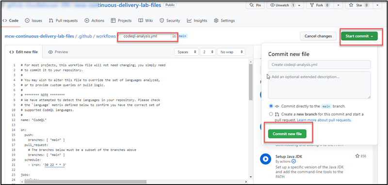
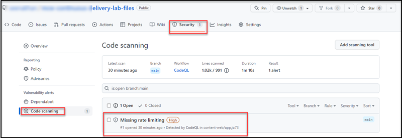
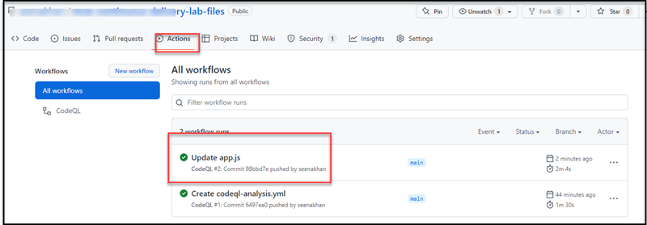
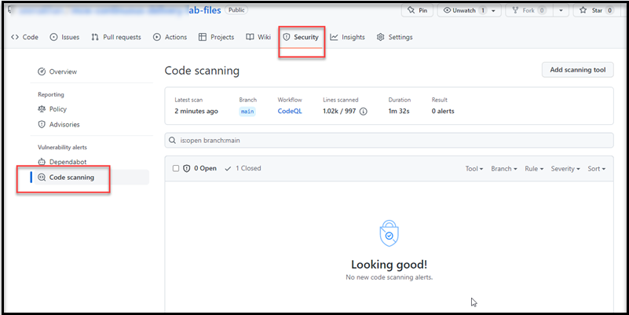

# Exercise 3: Explore GitHub advance security features 

Duration 60 minutes

Once the Fabrikamk Medical Conferences developer workflow has been deployed, we can apply the github advance security features.

## Task 1:
**Help references**


## Task 2: Enabling Github Dependabot 

## Task 3: Enabling Codescanning and CodeQL alerts 

What is codescanning? 
Code scanning is a feature that you use to analyze the code in a GitHub repository to find security vulnerabilities and coding errors. Any problems identified by the analysis are shown in GitHub.

1. Make sure your repository is public

   **Note:** If the repository visibility is private, go to the settings of the repository and change the visibility to public.
   
1. Go to seetings tab of the repository, then under security tab select code security and analysis.


   
   

1. Then you will reach into Codescanning pane under security tab, click on configure codeQL alerts.


   
   
  
1. It will generate a workflow codeql-analysis.yml. Review the yml file, you can find how many languages supported by codeQL and click on Start Commit, then click on      commit new file
  
  
   
  
  
  
  **Note:** For most projects, this workflow file will not need changing; you simply need to commit it to your repository. You may wish to alter this file to             override the set of languages analyzed or to provide custom queries or build logic.
  
  Under Actions tab you can see the workflow committed successfully.
  
  
    
  
  
1. Go to Codescanning under security tab you can see code scanning alerts enabled. Click on View alerts
   
   
    
    
    
 1. Click on the Missing rate Limiting alert and find on which line the alert showing, it will be on 73 line of the App.js file.


    
    
    You can see App.js file having the issue of Missing rate Limiting under Content-web folder
    
    
    
  1. Open App.js file from the content folder and Add the following code after the 6th line of App.js file
  
     ```pwsh
       // set up rate limiter: maximum of five requests per minute
        var RateLimit = require('express-rate-limit');
       var limiter = new RateLimit({
        windowMs: 1*60*1000, // 1 minute
        max: 5
        });
      ```
         
      
      After adding the code it will looks like this
      
      
      
  1. Add the following code before the alert line which would be 79 starts with app.get('*', (req, res) => {
   
      ```pwsh
        // apply rate limiter to all requests
        app.use(limiter);
      ```
    
   1. After adding the code it will looks like this
        
      
      
 1. After adding the entire code commit the file. It will successfully commit.
 
    
  
  1. Go to codescanning under security tab, you can see the missing rate limit cleared.
  
      

      
      
  
  

    
